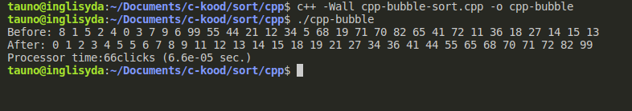

Identical bubble sort algorithm in C and C++. Same data and same computer. Experiment shows that C is twice as slow as C++.

In C it takes 124 processor clicks or 0.000124 sec.

In C++ it takes 66 processor clicks or 0.000066 sec.

```bash
gcc -Wall c-bubble-sort.c -o c-bubble-sort
```

```bash
c++ -Wall cpp-bubble-sort.cpp -o cpp-bubble-sort
```



